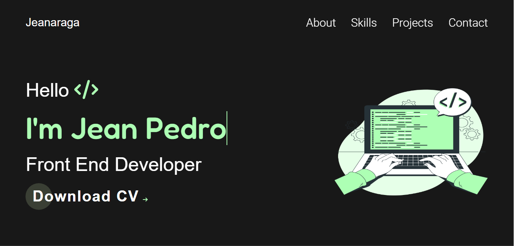

# Meu Portfolio

## 📝 Descrição

Esse é um portfolio que eu fiz, para as pessoas que quiserem me conhecer,saber das minhas habilidades e projetos pessoais, possam acessar facilmente.

O design é original meu,não peguei de nenhum template pronto ou algo assim, o design é um conjunto de várias inspirações que eu vi para fazer-lo.

O portfolio é responsivo para todas as telas.

Para acessa-lo clique [aqui](https://jeanaraga.github.io/Novo-Portf-lio/)

## 📚 Linguagens

- HTML
- CSS
- Javascript

## 🛠 Ferramentas e Sites Auxiliadores

- VSCode 
- Github Desktop
- Coolors
- Scroll Reveal (Scroll Animado)
- WebCode.Tools
- Pintrest
- Storyset (Site de Gerar Imagens Ilustrativas)

## ⚙️ Ajustes e Melhorias

✅ Projeto Concluido

## 👨🏾‍💻 Feito por 

<table>
  <tr>
    <td align="center">
    <a href="#">
         
        
          <b>Jean Pedro</b>
        
      </a>
    </td>
  </tr>
</table>
